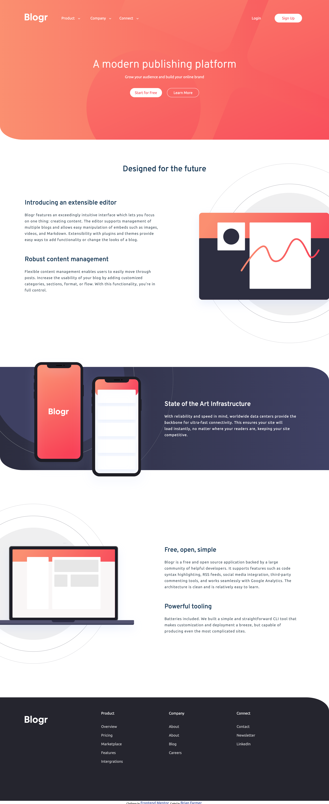

# Frontend Mentor - Blogr landing page solution

This is a solution to the [Blogr landing page challenge on Frontend Mentor](https://www.frontendmentor.io/challenges/blogr-landing-page-EX2RLAApP). Frontend Mentor challenges help you improve your coding skills by building realistic projects.

## Table of contents

- [The challenge](#the-challenge)
- [Overview](#overview)
- [Screenshot](#screenshot)
- [Links](#links)
- [My process](#my-process)
- [Built with](#built-with)
- [What I learned](#what-i-learned)
- [Continued development](#continued-development)
- [Useful resources](#useful-resources)
- [Author](#author)
- [Acknowledgments](#acknowledgments)

## The challenge

Users should be able to:

- View the optimal layout for the site depending on their device's screen size
- See hover states for all interactive elements on the page

### Overview

- Desktop designed on 1400 X 900 resolution with hover styles applied across elements. Sub-menus open on hover on the parent li and close once the device is moved. All hover and active item states work as designed.

- Mobile design is based on the 375 X 677 resolution of the Iphone 6/7/8. Hover states do not apply to mobile design and submenu work on click or touch of the screen.

### Screenshot



### Links

- Solution URL: [ Solution URL here](https://www.frontendmentor.io/solutions/blogr-landing-page-built-with-html-scss-and-javascript-BXOqqRrdT)
- GitHub URL: [GitHub URL here](https://github.com/brianlfarmerllc/fem_blogr_landing_page)
- Live Site URL: [Live site URL here](https://fem-blogr-landing.netlify.app/)

## My process

### Built with

- Semantic HTML5 markup
- SASS Pre-Processor
- CSS custom properties
- Flexbox
- Javascript functionality

### What I learned

Sub-menus! Seems easy right! Well I really had to dig deep to find working solutions to produce the desired behaviour. I wanted the menus to open on hover with click operations disabled on desktop view and open on click with hover operations removed on mobile view. I spent a lot of time on this and tried to tackle it various ways. The easiest way I decided was to use a @media (min-width) to only allow the hover when the view was above my mobile layout and it works really well. I have used @media (max-width) but never paid much attention to its couterpart until this project.

```html
<h1>This only gets assigned when the screen width is above 1050px</h1>
```

```css
@media screen and (min-width: 1050px) {
  nav {
    .logo-nav {
      .main-ul {
        .li1 {
          padding: 4rem 0rem;
          &:hover {
            .flip {
              padding-right: 1rem;
              padding-left: 0;
              transform: rotate(180deg);
            }
            .dropUl1 {
              @include dropMenu();
              li {
                a {
                  pointer-events: auto;
                }
              }
            }
          }
          a {
            pointer-events: none;
          }
        }
      }
    }
  }
}
```

Another thing I learned and found useful was applying functions when the screen resizes. I was having the issue of opening a sub-menu in mobile view, then if I resized to desktop, the sub-menu would stay open with no ability to close because pointer events were set to none on the "a" element in the above code. This solved that issue by deteting the screen size and removing the desired classes.

```js
function resize() {
  if (window.innerWidth > 1050) {
    burger.classList.remove("active");
    mobilMenu.classList.remove("nav-open");
    inactiveUl.forEach((ul) => ul.classList.remove("dropUl"));
    arrow.forEach((img) => img.classList.remove("active"));
  }
}
```

### Continued development

I only recently started working with SASS css pre-procesor. I find it to be an extremely helpful tool for writing and css. I really find the @mixin helpers very useful for reusing code and plan to incorporate more of this style in future projects.

### Useful resources

[@media min and max](https://www.emailonacid.com/blog/article/email-development/emailology_media_queries_demystified_min-width_and_max-width/) - This help me alot when trying to figure out how to apply hover to an element only on my desktop view. Originally I wanted to make a class and apply it when the screen size was detected above 1050px but I found this method with pure css simpler.

## Author

- Website - [Brian Farmer](https://brianlfarmerllc-biosite.netlify.app/)
- GitHub URL: - [GitHub URL](https://github.com/brianlfarmerllc/fem_blogr_landing_page)
- Frontend Mentor - [@brianlfarmerllc](https://www.frontendmentor.io/profile/brianlfarmerllc)
